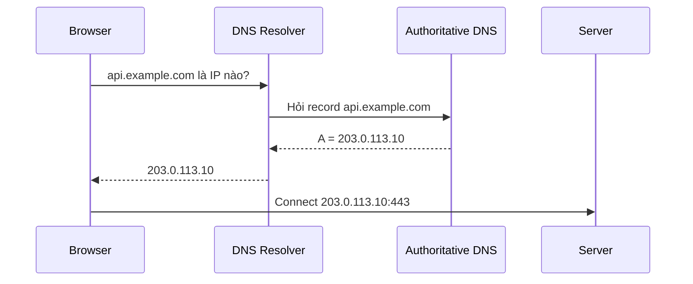

# DNS cơ bản

## Mục tiêu

- Hiểu DNS biến domain thành IP như thế nào.
- Biết các record thường gặp: `A`, `AAAA`, `CNAME`, `MX`, `TXT`, `NS`.
- Biết debug lỗi domain không trỏ đúng server.

## DNS là gì?

DNS giống danh bạ của Internet.

```text
api.example.com -> 203.0.113.10
```

Trình duyệt cần IP để kết nối, nhưng người dùng nhớ domain dễ hơn.



## Các DNS record thường gặp

| Record | Công dụng | Ví dụ |
| --- | --- | --- |
| `A` | Domain -> IPv4 | `api.example.com -> 203.0.113.10` |
| `AAAA` | Domain -> IPv6 | `example.com -> 2001:db8::1` |
| `CNAME` | Alias sang domain khác | `www -> example.com` |
| `MX` | Mail server | Google Workspace/Microsoft 365 |
| `TXT` | Text record, verify domain, SPF/DKIM | `v=spf1 ...` |
| `NS` | Nameserver quản lý zone | `ns1.provider.com` |

## `A` record

```text
api.example.com A 203.0.113.10
```

Ý nghĩa:

- `api.example.com` trỏ trực tiếp tới IPv4 `203.0.113.10`.
- Thường dùng cho server/load balancer có IP cố định.

Kiểm tra:

```bash
nslookup api.example.com
```

Kết quả mẫu:

```text
Name: api.example.com
Address: 203.0.113.10
```

## `CNAME` record

```text
www.example.com CNAME example.com
```

Ý nghĩa:

- `www.example.com` là alias.
- DNS tiếp tục resolve `example.com`.

Hay dùng khi:

- Trỏ domain phụ vào dịch vụ hosting/CDN.
- Muốn tránh hard-code IP.

## TTL là gì?

TTL là thời gian DNS record được cache.

Ví dụ:

```text
TTL = 300 seconds
```

Ý nghĩa:

- Resolver có thể cache record trong 5 phút.
- Khi đổi DNS, không phải ai cũng thấy ngay lập tức.

Gợi ý:

- Trước migration domain, giảm TTL xuống thấp trước.
- Sau khi ổn định, có thể tăng TTL để giảm query.

## Công cụ kiểm tra DNS

Linux:

```bash
nslookup example.com
dig example.com A
dig example.com CNAME
dig example.com MX
```

PowerShell:

```powershell
Resolve-DnsName example.com
Resolve-DnsName example.com -Type MX
```

Kết quả mẫu:

```text
example.com. 300 IN A 93.184.216.34
```

Giải thích:

- `300`: TTL.
- `IN`: Internet class.
- `A`: record type.
- `93.184.216.34`: IP trả về.

## Lỗi DNS thường gặp

| Lỗi | Dấu hiệu | Cách kiểm tra |
| --- | --- | --- |
| Domain chưa trỏ | `NXDOMAIN` | `nslookup domain` |
| Trỏ sai IP | Vào nhầm server | So record DNS với IP server/LB |
| CNAME sai | Resolve vòng hoặc không ra IP | `dig domain CNAME` |
| DNS cache | Máy này thấy IP cũ, máy kia thấy IP mới | Kiểm tra TTL, thử resolver khác |
| Sai nameserver | Record sửa ở nơi không có hiệu lực | Kiểm tra `NS` record |

## DNS trong deploy

Khi deploy app với domain:

```text
Domain -> DNS record -> Load Balancer/Nginx IP -> App
```

Checklist:

- [ ] Domain đang dùng nameserver nào?
- [ ] Record `A`/`CNAME` đã đúng chưa?
- [ ] TTL là bao nhiêu?
- [ ] Nginx `server_name` khớp domain chưa?
- [ ] HTTPS certificate cấp cho đúng domain chưa?

## Lab nhỏ

Chọn một domain thật, ví dụ domain của bạn hoặc `example.com`:

```bash
nslookup example.com
dig example.com A
dig example.com NS
curl -I https://example.com
```

Ghi lại:

- Domain resolve ra IP nào?
- TTL khoảng bao nhiêu?
- Nameserver là gì?
- HTTP status code là gì?

## Câu hỏi ôn tập

- DNS giải quyết vấn đề gì?
- `A` khác `CNAME` thế nào?
- TTL ảnh hưởng gì khi đổi IP server?
- Vì sao sửa DNS xong có thể chưa thấy thay đổi ngay?
- Khi domain không vào được, bạn kiểm tra gì trước?

## Liên kết nội bộ

- [Request flow tổng quan](request-flow-tong-quan.md)
- [HTTP, HTTPS và TLS](http-https-tls.md)
- [Lab tổng hợp debug request flow](lab-debug-request-flow.md)

