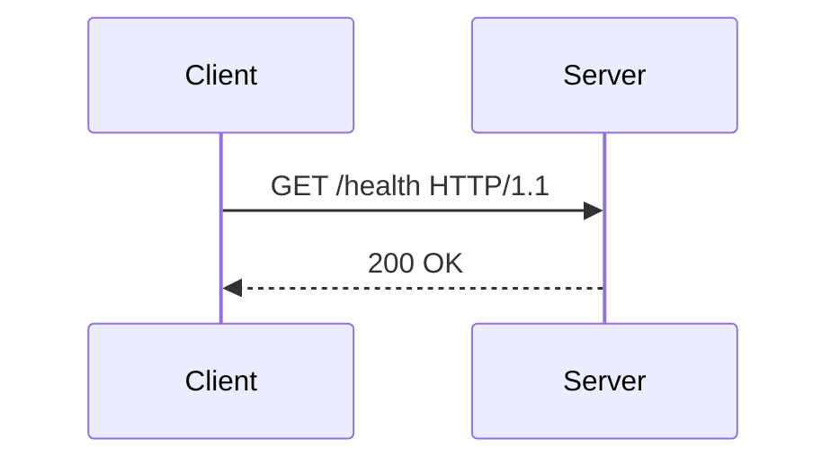
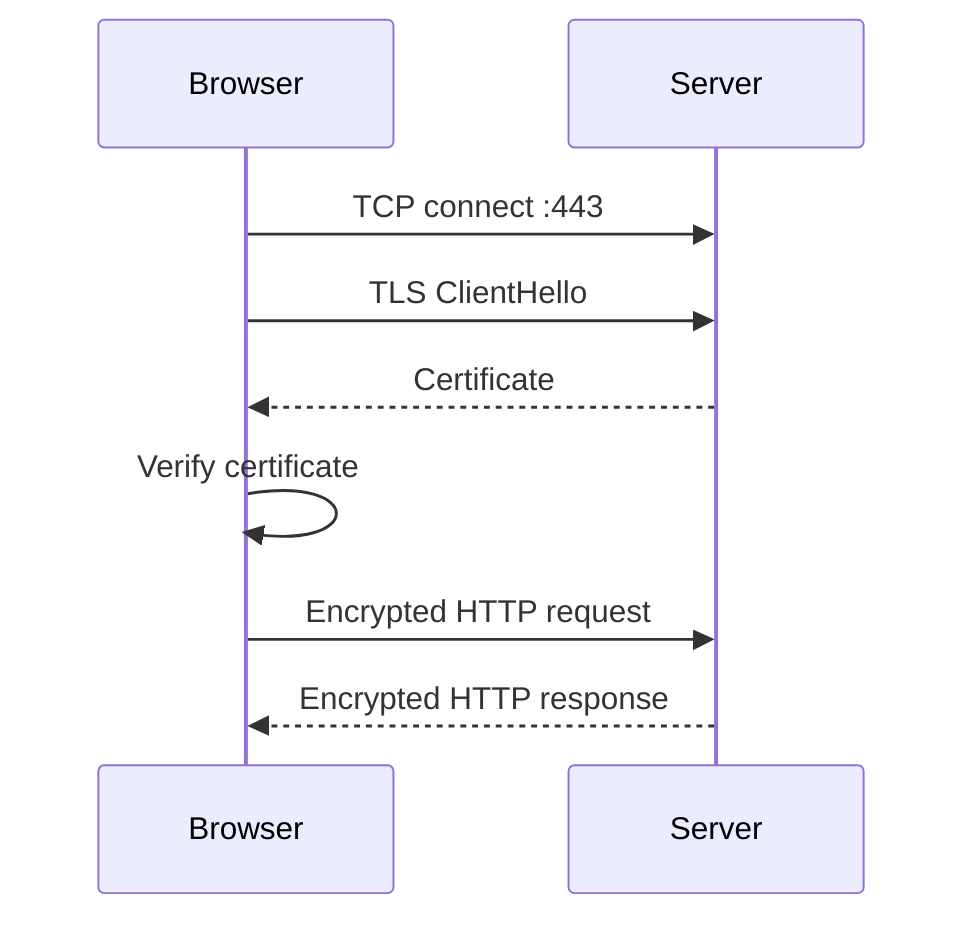

# HTTP, HTTPS và TLS

## Mục tiêu

- Hiểu request/response HTTP gồm method, path, header, body, status code.
- Biết HTTPS/TLS bảo vệ kết nối như thế nào.
- Biết dùng `curl` để debug API/web.

## HTTP là gì?

HTTP là protocol request/response giữa client và server.



Một request có:

```text
GET /users?page=1 HTTP/1.1
Host: api.example.com
Authorization: Bearer token
Accept: application/json
```

Một response có:

```text
HTTP/1.1 200 OK
Content-Type: application/json

{"items":[]}
```

## HTTP methods

| Method | Ý nghĩa thường dùng | Ví dụ |
| --- | --- | --- |
| `GET` | Lấy dữ liệu | Lấy danh sách user |
| `POST` | Tạo mới/gửi dữ liệu | Tạo order |
| `PUT` | Cập nhật toàn bộ | Cập nhật profile |
| `PATCH` | Cập nhật một phần | Đổi trạng thái task |
| `DELETE` | Xóa | Xóa item |
| `HEAD` | Lấy header, không lấy body | Kiểm tra endpoint |
| `OPTIONS` | Hỏi server hỗ trợ gì/CORS | Preflight request |

## Status code

| Nhóm | Ý nghĩa | Ví dụ |
| --- | --- | --- |
| `2xx` | Thành công | `200 OK`, `201 Created` |
| `3xx` | Redirect | `301`, `302`, `308` |
| `4xx` | Lỗi phía client/request | `400`, `401`, `403`, `404` |
| `5xx` | Lỗi phía server/proxy/app | `500`, `502`, `503`, `504` |

Debug nhanh:

```bash
curl -i https://example.com
```

`-i` hiển thị cả response header và body.

## Header quan trọng

| Header | Ý nghĩa |
| --- | --- |
| `Host` | Domain request đang gọi |
| `Content-Type` | Kiểu body gửi lên |
| `Accept` | Client muốn nhận kiểu dữ liệu nào |
| `Authorization` | Token/certificate auth |
| `Cookie` | Cookie gửi từ browser |
| `Set-Cookie` | Server yêu cầu browser lưu cookie |
| `Cache-Control` | Cache policy |
| `Location` | URL redirect |
| `X-Forwarded-For` | IP client qua proxy |
| `X-Forwarded-Proto` | HTTP/HTTPS gốc qua proxy |

## Body và JSON

Gửi JSON bằng `curl`:

```bash
curl -i -X POST https://api.example.com/users \
  -H "Content-Type: application/json" \
  -d '{"name":"Ada"}'
```

Kết quả mẫu:

```text
HTTP/2 201
content-type: application/json

{"id":1,"name":"Ada"}
```

Giải thích:

- `-X POST`: method POST.
- `-H`: thêm header.
- `-d`: gửi body.
- `201`: resource được tạo.

## HTTPS và TLS

HTTPS là HTTP chạy bên trong kết nối TLS.

TLS giúp:

- Mã hóa dữ liệu trên đường truyền.
- Xác thực server bằng certificate.
- Giảm nguy cơ bị nghe lén/sửa dữ liệu.

Flow đơn giản:



## Certificate cần đúng gì?

Certificate HTTPS cần:

- Chưa hết hạn.
- Domain trong cert khớp domain truy cập.
- Chain hợp lệ.
- Private key tương ứng.

Kiểm tra bằng `curl`:

```bash
curl -vI https://example.com
```

Trong output, để ý:

```text
SSL certificate verify ok.
```

Kiểm tra bằng OpenSSL:

```bash
openssl s_client -connect example.com:443 -servername example.com
```

## CORS là gì?

CORS là cơ chế browser kiểm soát frontend domain nào được gọi API domain nào.

Ví dụ:

```text
Frontend: https://app.example.com
API:      https://api.example.com
```

Nếu API không cho phép origin `https://app.example.com`, browser có thể chặn request.

Header thường gặp:

```text
Access-Control-Allow-Origin: https://app.example.com
Access-Control-Allow-Methods: GET,POST,PUT,DELETE
Access-Control-Allow-Headers: Authorization,Content-Type
```

Lưu ý:

- CORS là lỗi phía browser, không phải lúc nào `curl` cũng tái hiện được.
- Khi frontend gọi API lỗi CORS, mở browser console/network tab để xem.

## Lab nhỏ với `curl`

Chạy:

```bash
curl -I https://example.com
curl -i https://example.com
curl -vI https://example.com
```

Tự trả lời:

- Status code là gì?
- Có redirect không?
- Server trả content-type gì?
- TLS verify có OK không?
- Header nào liên quan cache?

## Câu hỏi ôn tập

- HTTP request gồm những phần nào?
- `GET` khác `POST` thế nào?
- `401` khác `403` thế nào?
- `500` khác `502` thế nào?
- HTTPS thêm gì so với HTTP?
- Certificate sai domain sẽ gây lỗi gì?
- CORS xảy ra ở server hay browser?

## Liên kết nội bộ

- [DNS cơ bản](dns-co-ban.md)
- [Nginx cơ bản](nginx-co-ban.md)
- [Công cụ debug networking](cong-cu-debug-networking.md)

