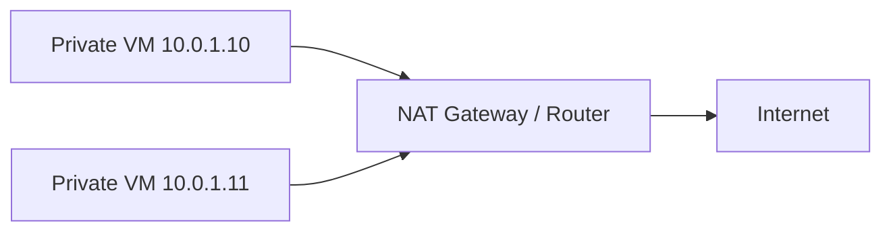

# IP, port, subnet và NAT

## Mục tiêu

- Hiểu IP address, port, socket, subnet, gateway, NAT ở mức cần cho DevOps.
- Phân biệt IP private/public, loopback, localhost.
- Biết kiểm tra máy đang nghe port nào và debug lỗi port không mở.

## IP address là gì?

IP address là địa chỉ của một máy hoặc interface trong mạng.

Ví dụ:

```text
192.168.1.10
10.0.0.5
172.20.10.2
8.8.8.8
127.0.0.1
```

Các dải private thường gặp:

| Dải | Ghi chú |
| --- | --- |
| `10.0.0.0/8` | Private network lớn |
| `172.16.0.0/12` | Private network |
| `192.168.0.0/16` | Mạng gia đình/văn phòng |
| `127.0.0.0/8` | Loopback, chính máy hiện tại |

## `localhost` và `127.0.0.1`

`localhost` thường trỏ về `127.0.0.1`.

```bash
ping -c 2 127.0.0.1
ping -c 2 localhost
```

Ý nghĩa:

- App listen `127.0.0.1:3000`: chỉ máy local gọi được.
- App listen `0.0.0.0:3000`: nhận kết nối từ mọi interface.

Khi deploy với Nginx:

```text
Nginx public :80/:443 -> App listen 127.0.0.1:3000
```

Cách này an toàn hơn mở app Node.js trực tiếp ra Internet.

## Port là gì?

Port là số định danh ứng dụng/service trên một máy.

| Port | Service thường gặp |
| --- | --- |
| `22` | SSH |
| `53` | DNS |
| `80` | HTTP |
| `443` | HTTPS |
| `3000` | App dev/Node/Next.js |
| `3001` | API dev/NestJS |
| `5432` | PostgreSQL |
| `3306` | MySQL |
| `6379` | Redis |

Một kết nối thường có dạng:

```text
IP:PORT
127.0.0.1:3000
10.0.0.5:5432
example.com:443
```

## Socket là gì?

Socket thường được hiểu là cặp IP + port + protocol.

Ví dụ:

```text
TCP 127.0.0.1:3000
TCP 0.0.0.0:80
UDP 0.0.0.0:53
```

Kiểm tra port đang listen:

```bash
sudo ss -lntp
```

Kết quả mẫu:

```text
State  Local Address:Port  Process
LISTEN 127.0.0.1:3000      users:(("node",pid=1234,fd=22))
LISTEN 0.0.0.0:80          users:(("nginx",pid=900,fd=6))
```

Giải thích:

- Node chỉ nghe local `127.0.0.1:3000`.
- Nginx nghe public `0.0.0.0:80`.

## TCP và UDP

| Protocol | Đặc điểm | Ví dụ |
| --- | --- | --- |
| TCP | Có kết nối, đảm bảo thứ tự/giao hàng | HTTP, HTTPS, SSH, DB |
| UDP | Không cần kết nối, nhẹ hơn | DNS, streaming, gaming |

DevOps web/app thường debug TCP nhiều nhất.

Kiểm tra TCP port:

```bash
curl -I http://127.0.0.1:3000
```

Hoặc:

```bash
nc -vz 127.0.0.1 3000
```

Kết quả mẫu:

```text
Connection to 127.0.0.1 3000 port [tcp/*] succeeded!
```

## Subnet là gì?

Subnet chia mạng thành các vùng nhỏ.

Ví dụ:

```text
192.168.1.0/24
```

Ý nghĩa đơn giản:

- Network: `192.168.1.0`
- Dải host thường dùng: `192.168.1.1` đến `192.168.1.254`
- `/24` là subnet mask `255.255.255.0`

Trong DevOps/cloud:

- Public subnet: có đường ra/vào Internet trực tiếp qua Internet Gateway/Load Balancer.
- Private subnet: chứa app/database, không mở trực tiếp ra Internet.

## Gateway là gì?

Gateway là "cửa ra" để máy đi tới mạng khác.

Kiểm tra route:

```bash
ip route
```

Kết quả mẫu:

```text
default via 172.20.0.1 dev eth0
172.20.0.0/20 dev eth0 proto kernel scope link src 172.20.10.2
```

Giải thích:

- `default via 172.20.0.1`: nếu không biết đi đâu, gửi qua gateway `172.20.0.1`.
- `src 172.20.10.2`: IP của máy/interface hiện tại.

## NAT là gì?

NAT cho phép nhiều máy private đi ra Internet qua một IP public.



Ví dụ thực tế:

- Máy trong mạng nhà bạn có IP `192.168.1.x`.
- Router có IP public.
- Khi bạn truy cập Internet, router NAT địa chỉ private ra public.

Trong cloud:

- App server private subnet dùng NAT Gateway để tải package/update.
- Database thường không cần ra Internet trực tiếp.

## Firewall và security group

Port listen chưa chắc đã truy cập được. Firewall có thể chặn.

Kiểm tra trên server:

```bash
sudo ss -lntp | grep 3000
```

Kiểm tra từ máy khác:

```bash
nc -vz server-ip 3000
```

Nếu server listen nhưng bên ngoài không vào được:

- App chỉ bind `127.0.0.1`.
- Firewall OS chặn.
- Cloud security group chặn.
- Nginx/load balancer chưa route vào.

## Lab nhỏ

Chạy trong WSL/Linux:

```bash
ip addr
ip route
sudo ss -lntp
curl -I http://127.0.0.1:80
```

Tự trả lời:

- Máy có những IP nào?
- Default gateway là gì?
- Port nào đang listen?
- Service nào giữ port đó?

## Câu hỏi ôn tập

- IP private khác IP public thế nào?
- `127.0.0.1` dùng để làm gì?
- `0.0.0.0:80` khác `127.0.0.1:80` thế nào?
- Port `80` và `443` dùng cho gì?
- NAT giúp giải quyết vấn đề gì?
- Vì sao database thường không mở public ra Internet?

## Liên kết nội bộ

- [Request flow tổng quan](request-flow-tong-quan.md)
- [Nginx cơ bản](nginx-co-ban.md)
- [Công cụ debug networking](cong-cu-debug-networking.md)

