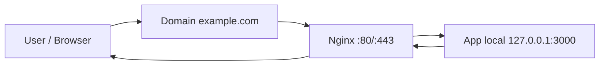
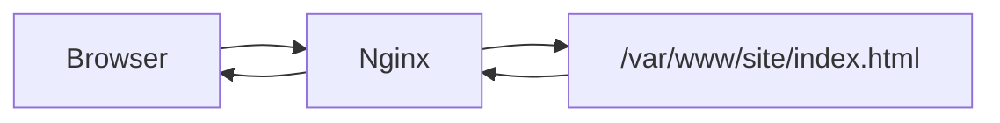
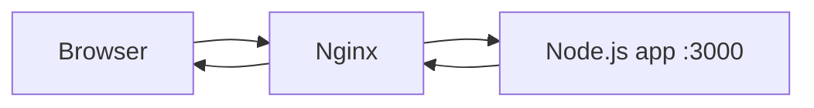

# Nginx cơ bản

## Mục tiêu

- Hiểu Nginx là gì và vì sao hay dùng khi deploy frontend/backend.
- Phân biệt web server, reverse proxy và load balancer ở mức cơ bản.
- Biết các file cấu hình Nginx quan trọng trên Ubuntu.
- Viết được cấu hình reverse proxy cho app chạy ở `127.0.0.1:3000` hoặc `127.0.0.1:3001`.
- Biết kiểm tra config, reload service, xem log và debug lỗi `502`, `404`, `403`.

## Nginx là gì?

Nginx là một web server rất phổ biến. Trong DevOps, Nginx thường đứng trước ứng dụng để nhận request từ user rồi xử lý hoặc chuyển tiếp vào app phía sau.

Nginx có thể làm nhiều vai trò:

| Vai trò | Ý nghĩa | Ví dụ |
| --- | --- | --- |
| Static web server | Phục vụ file tĩnh | HTML, CSS, JS, ảnh |
| Reverse proxy | Nhận request rồi chuyển vào app backend/frontend đang chạy local | Proxy vào Next.js `:3000`, NestJS `:3001` |
| TLS termination | Xử lý HTTPS certificate | User vào `https://example.com` |
| Load balancer | Chia traffic tới nhiều app instance | API instance 1, 2, 3 |
| Basic gateway | Thêm header, giới hạn body, timeout, redirect | Redirect HTTP sang HTTPS |

Trong lab deploy Next.js/NestJS không Docker, Nginx chủ yếu dùng làm **reverse proxy**.

## Vì sao cần Nginx?

App Node.js thường chạy ở port nội bộ như:

```text
Next.js: 127.0.0.1:3000
NestJS: 127.0.0.1:3001
```

Người dùng bên ngoài thường truy cập:

```text
http://example.com
https://example.com
```

Nginx đứng giữa:



Lợi ích:

- User không cần biết app chạy port nào.
- App có thể chỉ listen local `127.0.0.1`, giảm rủi ro mở port trực tiếp.
- Dễ gắn domain và HTTPS.
- Dễ route nhiều app trên cùng một server.
- Dễ xem access log/error log.
- Dễ reload config mà không restart app.

## Web server và reverse proxy khác nhau thế nào?

### Static web server

Nginx tự đọc file từ disk và trả về cho browser.



Ví dụ:

```nginx
server {
    listen 80;
    server_name static.example.com;
    root /var/www/static-site;
    index index.html;
}
```

### Reverse proxy

Nginx không tự xử lý logic app. Nó chuyển request vào app phía sau.



Ví dụ:

```nginx
server {
    listen 80;
    server_name app.example.com;

    location / {
        proxy_pass http://127.0.0.1:3000;
    }
}
```

## Cấu trúc file Nginx trên Ubuntu

Các đường dẫn hay gặp:

| Đường dẫn | Công dụng |
| --- | --- |
| `/etc/nginx/nginx.conf` | File cấu hình chính |
| `/etc/nginx/sites-available/` | Nơi lưu cấu hình site |
| `/etc/nginx/sites-enabled/` | Site đang được bật, thường là symlink sang `sites-available` |
| `/etc/nginx/conf.d/` | Cấu hình phụ dạng `.conf` |
| `/var/log/nginx/access.log` | Log request thành công/thường |
| `/var/log/nginx/error.log` | Log lỗi |

Flow thường dùng:

```text
Tạo file trong sites-available
-> symlink sang sites-enabled
-> nginx -t
-> systemctl reload nginx
```

## Các lệnh Nginx quan trọng

| Lệnh | Công dụng |
| --- | --- |
| `nginx -v` | Xem version Nginx |
| `sudo nginx -t` | Kiểm tra syntax config |
| `sudo systemctl status nginx` | Xem trạng thái service |
| `sudo systemctl start nginx` | Start Nginx |
| `sudo systemctl stop nginx` | Stop Nginx |
| `sudo systemctl restart nginx` | Restart Nginx |
| `sudo systemctl reload nginx` | Reload config không ngắt service mạnh như restart |
| `sudo journalctl -u nginx -f` | Xem log service Nginx |
| `sudo tail -f /var/log/nginx/access.log` | Theo dõi access log |
| `sudo tail -f /var/log/nginx/error.log` | Theo dõi error log |

Ghi nhớ:

```bash
sudo nginx -t && sudo systemctl reload nginx
```

Giải thích:

- Chỉ reload nếu config hợp lệ.
- Tránh reload config lỗi làm Nginx không hoạt động đúng.

## Cấu hình server block

Một `server` block mô tả một website/domain.

Ví dụ:

```nginx
server {
    listen 80;
    server_name example.com www.example.com;

    location / {
        proxy_pass http://127.0.0.1:3000;
    }
}
```

Giải thích:

| Directive | Ý nghĩa |
| --- | --- |
| `server` | Một site hoặc virtual host |
| `listen 80` | Nginx nhận request HTTP port 80 |
| `server_name` | Domain nào được block này xử lý |
| `location /` | Áp dụng cho mọi path bắt đầu bằng `/` |
| `proxy_pass` | Chuyển request tới upstream app |

## `location` là gì?

`location` quyết định request path nào được xử lý bởi block nào.

Ví dụ:

```nginx
server {
    listen 80;
    server_name example.com;

    location /api/ {
        proxy_pass http://127.0.0.1:3001;
    }

    location / {
        proxy_pass http://127.0.0.1:3000;
    }
}
```

Ý nghĩa:

- Request `/api/users` đi vào backend port `3001`.
- Request `/`, `/about`, `/dashboard` đi vào frontend port `3000`.

## `proxy_pass` là gì?

`proxy_pass` nói với Nginx: "request này chuyển tiếp đến app phía sau".

Ví dụ:

```nginx
location / {
    proxy_pass http://127.0.0.1:3000;
}
```

Request flow:

```text
Browser -> Nginx :80 -> 127.0.0.1:3000 -> Nginx -> Browser
```

Nginx không chạy code Next.js/NestJS. App Node.js vẫn chạy riêng bằng `systemd`, Nginx chỉ chuyển request.

## Header quan trọng khi reverse proxy

Cấu hình nên có:

```nginx
location / {
    proxy_pass http://127.0.0.1:3000;
    proxy_http_version 1.1;
    proxy_set_header Host $host;
    proxy_set_header X-Real-IP $remote_addr;
    proxy_set_header X-Forwarded-For $proxy_add_x_forwarded_for;
    proxy_set_header X-Forwarded-Proto $scheme;
}
```

Giải thích:

| Header | Ý nghĩa |
| --- | --- |
| `Host` | Giữ domain gốc user gọi |
| `X-Real-IP` | IP thật của client |
| `X-Forwarded-For` | Chuỗi IP proxy/client |
| `X-Forwarded-Proto` | HTTP hay HTTPS |

Nếu thiếu các header này, app phía sau có thể không biết request gốc đến từ domain/protocol/IP nào.

## Nginx cho Next.js

Next.js chạy production ở local port `3000`.

```nginx
server {
    listen 80;
    server_name next.example.com;

    location / {
        proxy_pass http://127.0.0.1:3000;
        proxy_http_version 1.1;
        proxy_set_header Host $host;
        proxy_set_header X-Real-IP $remote_addr;
        proxy_set_header X-Forwarded-For $proxy_add_x_forwarded_for;
        proxy_set_header X-Forwarded-Proto $scheme;
        proxy_set_header Upgrade $http_upgrade;
        proxy_set_header Connection "upgrade";
    }
}
```

Vì sao có `Upgrade` và `Connection`?

- Hữu ích cho WebSocket hoặc một số cơ chế cần nâng cấp kết nối.
- Với Next.js, giữ cấu hình này thường an toàn cho dev/prod setup có realtime hoặc HMR ở môi trường phù hợp.

## Nginx cho NestJS

NestJS API chạy local port `3001`.

```nginx
server {
    listen 80;
    server_name api.example.com;

    location / {
        proxy_pass http://127.0.0.1:3001;
        proxy_http_version 1.1;
        proxy_set_header Host $host;
        proxy_set_header X-Real-IP $remote_addr;
        proxy_set_header X-Forwarded-For $proxy_add_x_forwarded_for;
        proxy_set_header X-Forwarded-Proto $scheme;
    }
}
```

Kiểm tra:

```bash
curl -i http://api.example.com/health
```

Kết quả mong muốn:

```text
HTTP/1.1 200 OK
```

## Một domain chạy frontend và backend

Có thể dùng cùng domain, tách backend bằng path `/api`.

```nginx
server {
    listen 80;
    server_name example.com;

    location /api/ {
        proxy_pass http://127.0.0.1:3001/;
        proxy_http_version 1.1;
        proxy_set_header Host $host;
        proxy_set_header X-Real-IP $remote_addr;
        proxy_set_header X-Forwarded-For $proxy_add_x_forwarded_for;
        proxy_set_header X-Forwarded-Proto $scheme;
    }

    location / {
        proxy_pass http://127.0.0.1:3000;
        proxy_http_version 1.1;
        proxy_set_header Host $host;
        proxy_set_header X-Real-IP $remote_addr;
        proxy_set_header X-Forwarded-For $proxy_add_x_forwarded_for;
        proxy_set_header X-Forwarded-Proto $scheme;
    }
}
```

Lưu ý với dấu `/` trong `proxy_pass`:

- `proxy_pass http://127.0.0.1:3001/;` có thể rewrite path khác với `proxy_pass http://127.0.0.1:3001;`.
- Khi deploy thật, cần test kỹ path `/api/health`, `/api/users`.

## Static file với `root`

Nếu frontend build ra static files, Nginx có thể serve trực tiếp.

Ví dụ:

```nginx
server {
    listen 80;
    server_name static.example.com;
    root /var/www/static-site;
    index index.html;

    location / {
        try_files $uri $uri/ /index.html;
    }
}
```

Giải thích:

| Directive | Ý nghĩa |
| --- | --- |
| `root` | Thư mục chứa file |
| `index` | File mặc định |
| `try_files` | Thử tìm file, nếu không có thì fallback |

`try_files $uri $uri/ /index.html` hay dùng cho SPA như React/Vue để route frontend hoạt động khi refresh page.

## Access log và error log

Xem access log:

```bash
sudo tail -f /var/log/nginx/access.log
```

Output mẫu:

```text
192.168.1.10 - - [14/Jul/2026:10:10:00 +0700] "GET /health HTTP/1.1" 200 42 "-" "curl/8.5.0"
```

Giải thích:

- `192.168.1.10`: IP client.
- `"GET /health HTTP/1.1"`: method/path/protocol.
- `200`: status code.
- `curl/8.5.0`: user agent.

Xem error log:

```bash
sudo tail -f /var/log/nginx/error.log
```

Output mẫu khi upstream chết:

```text
connect() failed (111: Connection refused) while connecting to upstream
```

Giải thích:

- Nginx không kết nối được app phía sau.
- Thường app chưa chạy, sai port, hoặc bind sai interface.

## Lỗi thường gặp

| Lỗi | Nghĩa thường gặp | Kiểm tra |
| --- | --- | --- |
| `502 Bad Gateway` | Nginx không gọi được upstream app | `systemctl status app`, `ss -lntp`, `error.log` |
| `404 Not Found` | Không match route/file | `server_name`, `location`, app route |
| `403 Forbidden` | Không có quyền đọc file/thư mục hoặc index bị chặn | permission, `root`, `index` |
| `413 Payload Too Large` | Body upload vượt giới hạn | `client_max_body_size` |
| `504 Gateway Timeout` | Upstream phản hồi quá lâu | app log, DB, timeout |
| `nginx -t` fail | Sai syntax config | Đọc dòng lỗi mà `nginx -t` in ra |

Ví dụ tăng upload limit:

```nginx
server {
    listen 80;
    server_name upload.example.com;
    client_max_body_size 20m;
}
```

## Quy trình sửa cấu hình an toàn

1. Sửa file trong `sites-available`.
2. Kiểm tra syntax.
3. Reload Nginx.
4. Kiểm tra bằng `curl`.
5. Xem access/error log.

Lệnh:

```bash
sudo nginx -t
sudo systemctl reload nginx
curl -I http://example.com
sudo tail -n 50 /var/log/nginx/error.log
```

Không nên:

```bash
sudo systemctl restart nginx
```

ngay lập tức khi chưa `nginx -t`, vì config lỗi có thể làm Nginx không lên lại đúng cách.

## Lab: reverse proxy vào app local

Mục tiêu: tạo một app HTTP đơn giản ở port `3000`, rồi dùng Nginx proxy vào app đó.

### Bước 1: chạy app test

```bash
mkdir -p ~/devops-lab/nginx-demo
cd ~/devops-lab/nginx-demo
echo "Hello from local app" > index.html
python3 -m http.server 3000 --bind 127.0.0.1
```

Giữ terminal này đang chạy.

Mở terminal khác, kiểm tra:

```bash
curl http://127.0.0.1:3000
```

Kết quả:

```text
Hello from local app
```

### Bước 2: tạo Nginx site

```bash
sudo nano /etc/nginx/sites-available/nginx-demo
```

Nội dung:

```nginx
server {
    listen 8080;
    server_name _;

    location / {
        proxy_pass http://127.0.0.1:3000;
        proxy_set_header Host $host;
        proxy_set_header X-Real-IP $remote_addr;
        proxy_set_header X-Forwarded-For $proxy_add_x_forwarded_for;
        proxy_set_header X-Forwarded-Proto $scheme;
    }
}
```

Enable site:

```bash
sudo ln -sfn /etc/nginx/sites-available/nginx-demo /etc/nginx/sites-enabled/nginx-demo
sudo nginx -t
sudo systemctl reload nginx
```

### Bước 3: test qua Nginx

```bash
curl http://127.0.0.1:8080
```

Kết quả:

```text
Hello from local app
```

Giải thích:

- Browser/curl gọi Nginx ở port `8080`.
- Nginx chuyển request vào app Python ở `127.0.0.1:3000`.
- App trả response về Nginx, Nginx trả lại cho client.

### Bước 4: tạo lỗi 502 để hiểu debug

Dừng app Python ở terminal đầu bằng `Ctrl+C`.

Gọi lại:

```bash
curl -i http://127.0.0.1:8080
```

Kết quả mẫu:

```text
HTTP/1.1 502 Bad Gateway
```

Kiểm tra log:

```bash
sudo tail -n 20 /var/log/nginx/error.log
```

Bạn sẽ thấy Nginx không kết nối được upstream.

## Câu hỏi ôn tập

- Nginx là gì?
- Reverse proxy khác static web server thế nào?
- `sites-available` và `sites-enabled` khác nhau ra sao?
- `proxy_pass` dùng để làm gì?
- Vì sao app Node.js nên listen local rồi để Nginx public ra ngoài?
- Khi gặp `502 Bad Gateway`, bạn kiểm tra những gì?
- `sudo nginx -t` dùng để làm gì?
- Reload khác restart Nginx thế nào?
- Access log và error log khác nhau thế nào?
- Khi nào dùng `root`, khi nào dùng `proxy_pass`?

## Liên kết nội bộ

- [Networking](index.md)
- [Tư duy triển khai mọi dự án](../01-nen-tang/tu-duy-trien-khai-moi-du-an.md)
- [Deploy frontend Next.js không Docker](../13-projects/2.%20lab-deploy-nextjs-khong-docker.md)
- [Deploy backend NestJS không Docker](../13-projects/1.%20lab-deploy-nestjs-khong-docker.md)

