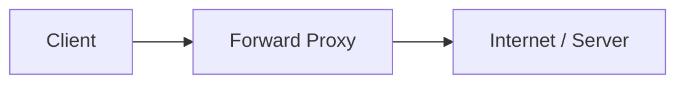
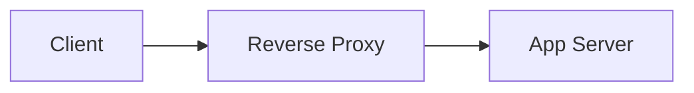
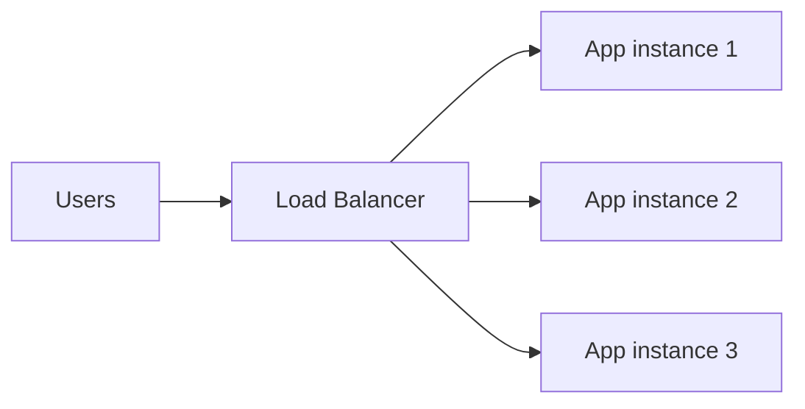
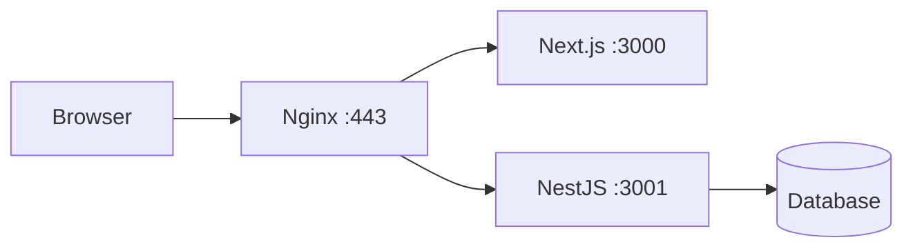

# Proxy, reverse proxy và load balancer

## Mục tiêu

- Phân biệt proxy, reverse proxy và load balancer.
- Hiểu vì sao Nginx/load balancer đứng trước app.
- Biết health check và lỗi `502/503/504` liên quan gì đến upstream.

## Proxy là gì?

Proxy là thành phần đứng giữa client và server.

Forward proxy đứng về phía client:



Ví dụ:

- Proxy công ty kiểm soát traffic đi ra Internet.
- VPN/proxy cho client.

Reverse proxy đứng về phía server:



Ví dụ:

- Nginx nhận request public rồi proxy vào app local.
- Load balancer cloud nhận HTTPS rồi chuyển vào app private.

## Reverse proxy dùng để làm gì?

Reverse proxy giúp:

- Ẩn app server phía sau.
- Route nhiều app/domain.
- Terminate TLS.
- Thêm header.
- Ghi access/error log.
- Giới hạn upload/body.
- Làm buffer/cache cơ bản.
- Chuyển traffic tới nhiều upstream.

## Load balancer là gì?

Load balancer chia traffic tới nhiều instance.



Lợi ích:

- Tăng khả năng chịu tải.
- Nếu một instance chết, chuyển traffic sang instance khỏe.
- Hỗ trợ rolling deploy/canary.

## L4 và L7 load balancing

| Loại | Dựa trên | Ví dụ |
| --- | --- | --- |
| L4 | TCP/UDP, IP, port | Chuyển TCP :443 |
| L7 | HTTP path/header/host | `/api` vào backend, `/` vào frontend |

Nginx có thể làm reverse proxy L7. Cloud load balancer cũng thường hỗ trợ L4/L7 tùy loại.

## Upstream là gì?

Upstream là server/app phía sau proxy.

Ví dụ Nginx:

```nginx
upstream api_backend {
    server 127.0.0.1:3001;
    server 127.0.0.1:3002;
}

server {
    listen 80;
    server_name api.example.com;

    location / {
        proxy_pass http://api_backend;
    }
}
```

Ý nghĩa:

- Nginx nhận request ở `api.example.com`.
- Nginx chuyển tới một trong hai upstream `3001` hoặc `3002`.

## Health check

Load balancer cần biết instance nào khỏe.

Endpoint thường gặp:

```text
GET /health
GET /healthz
GET /readyz
```

Response mẫu:

```json
{
  "status": "ok",
  "database": "ok"
}
```

Nếu health check fail:

- Load balancer có thể ngừng gửi traffic đến instance đó.
- Nginx open source không có active health check đầy đủ như một số LB, nhưng vẫn có thể failover theo lỗi kết nối với upstream.

## Sticky session

Sticky session giữ user vào cùng một backend instance.

Dùng khi:

- App lưu session local trong memory.
- Chưa chuyển session sang Redis/database.

Nhưng tốt hơn:

- App stateless.
- Session/token lưu ngoài app instance.
- Như vậy load balancing và scale dễ hơn.

## Lỗi proxy/load balancer thường gặp

| Lỗi | Ý nghĩa thường gặp | Kiểm tra |
| --- | --- | --- |
| `502 Bad Gateway` | Proxy không kết nối được upstream hoặc upstream trả response lỗi | App chết, sai port, protocol sai |
| `503 Service Unavailable` | Không có upstream khỏe hoặc service đang unavailable | Health check, app overload |
| `504 Gateway Timeout` | Upstream phản hồi quá lâu | App slow, DB slow, timeout config |

Debug:

```bash
curl -i http://127.0.0.1:3001/health
sudo tail -n 100 /var/log/nginx/error.log
sudo ss -lntp
```

## Proxy trong deploy Next/Nest

Một mô hình hay dùng:



Route mẫu:

```text
app.example.com      -> Next.js
api.example.com      -> NestJS
```

Hoặc:

```text
example.com/         -> Next.js
example.com/api/     -> NestJS
```

## Câu hỏi ôn tập

- Forward proxy khác reverse proxy thế nào?
- Load balancer giúp gì khi có nhiều app instance?
- L4 khác L7 ở điểm nào?
- Upstream là gì?
- Health check dùng để làm gì?
- `502`, `503`, `504` khác nhau thế nào?

## Liên kết nội bộ

- [Nginx cơ bản](nginx-co-ban.md)
- [HTTP, HTTPS và TLS](http-https-tls.md)
- [Tư duy triển khai](../01-nen-tang/tu-duy-trien-khai.md)

