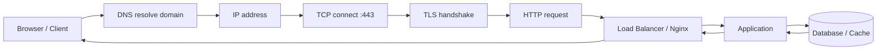

# Request flow tổng quan

## Mục tiêu

- Hiểu một request đi từ trình duyệt đến ứng dụng như thế nào.
- Biết các thành phần DNS, IP, port, TCP, TLS, HTTP, proxy, app, database nằm ở đâu trong flow.
- Có tư duy debug: lỗi xảy ra ở tầng nào thì kiểm tra bằng lệnh gì.

## Bức tranh lớn

Khi bạn mở một website như:

```text
https://api.example.com/users
```

Máy bạn không "đi thẳng vào domain". Nó phải đi qua nhiều bước:



Nếu một website lỗi, đừng chỉ nghĩ "server chết". Có thể lỗi ở DNS, network, firewall, TLS, Nginx, app, database hoặc code.

## Flow từng bước

| Bước | Chuyện gì xảy ra | Lỗi hay gặp | Lệnh debug |
| --- | --- | --- | --- |
| 1. DNS | Domain đổi thành IP | Domain sai, record chưa cập nhật | `nslookup`, `dig`, `Resolve-DnsName` |
| 2. Network route | Máy tìm đường đến IP | Mất mạng, route/firewall lỗi | `ping`, `traceroute`, `tracert` |
| 3. TCP connect | Mở kết nối tới port | Port đóng, service không listen | `curl`, `nc`, `telnet`, `Test-NetConnection` |
| 4. TLS | Bắt tay HTTPS | Cert hết hạn, sai domain | `curl -v`, `openssl s_client` |
| 5. HTTP | Gửi request method/path/header/body | 404, 401, 403, 500 | `curl -i` |
| 6. Proxy/LB | Nginx/LB chuyển request vào app | 502, 503, 504 | Nginx log, LB health check |
| 7. App | Code xử lý request | Bug, thiếu env, dependency lỗi | App log, systemd log |
| 8. Data | App gọi DB/cache/queue | DB down, timeout, auth fail | DB log, app log, metric |

## Ví dụ request HTTP

```bash
curl -i https://example.com
```

Kết quả mẫu:

```text
HTTP/2 200
content-type: text/html
server: nginx
date: Tue, 14 Jul 2026 10:00:00 GMT
```

Giải thích:

- `HTTP/2 200`: server trả thành công.
- `content-type`: loại nội dung.
- `server: nginx`: phía server có thể đang dùng Nginx.
- `date`: thời điểm response được tạo.

## Cách nghĩ khi debug

Đi từ ngoài vào trong:

```text
Domain -> IP -> Port -> TLS -> HTTP -> Proxy -> App -> Database
```

Không nên nhảy ngay vào sửa code khi chưa biết request chết ở đâu.

Ví dụ:

```text
User báo api.example.com lỗi
1. DNS có resolve không?
2. Port 443 có mở không?
3. TLS cert hợp lệ không?
4. Nginx có nhận request không?
5. Nginx có proxy được vào app không?
6. App có log lỗi không?
7. App có gọi DB thành công không?
```

## Các status code cần nhớ

| Code | Ý nghĩa nhanh | Thường kiểm tra |
| --- | --- | --- |
| `200` | OK | Bình thường |
| `301/302` | Redirect | HTTP sang HTTPS, đổi path |
| `400` | Request sai | Client gửi thiếu/sai dữ liệu |
| `401` | Chưa xác thực | Token/login |
| `403` | Không có quyền | Permission, policy |
| `404` | Không tìm thấy route/resource | Path, routing, Nginx location |
| `500` | Lỗi app/server | App log |
| `502` | Proxy không gọi được upstream | App chết/sai port |
| `503` | Service unavailable | App overload/down/maintenance |
| `504` | Gateway timeout | App/DB phản hồi quá lâu |

## Câu hỏi ôn tập

- Vì sao domain cần DNS trước khi kết nối?
- Port dùng để làm gì?
- TLS nằm trước hay sau HTTP?
- `502` thường gợi ý lỗi ở đâu?
- Khi user báo website lỗi, bạn kiểm tra theo thứ tự nào?

## Liên kết nội bộ

- [IP, port, subnet và NAT](ip-port-subnet-nat.md)
- [DNS cơ bản](dns-co-ban.md)
- [HTTP, HTTPS và TLS](http-https-tls.md)
- [Nginx cơ bản](nginx-co-ban.md)

