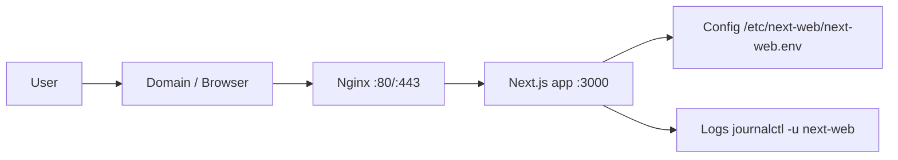

# Lab: Deploy frontend Next.js không Docker

## Mục tiêu

- Deploy một app Next.js trực tiếp trên Linux, không dùng Docker/container.
- Biết cách đọc dự án, cài dependency, build, run bằng systemd và đưa traffic qua Nginx.
- Tách code, config, log và user chạy app.
- Biết kiểm tra sau deploy và rollback bản trước.

## Phạm vi lab

Lab này dùng cách triển khai học tập:

```text
Git repo -> Linux server -> npm ci -> npm run build -> systemd chạy next start -> Nginx reverse proxy
```

Không dùng:

- Docker
- Kubernetes
- CI/CD tự động
- Image registry

Ghi nhớ: đây là lab để hiểu triển khai thủ công có kiểm soát. Sau này có CI/CD, các bước build/test/deploy sẽ được tự động hóa.

## Đọc trước

- [Nginx cơ bản](../03-networking/nginx-co-ban.md)

## Sơ đồ triển khai



## Điều kiện trước khi làm

Server Linux cần có:

- User có quyền `sudo`
- `git`
- Node.js đúng version dự án yêu cầu
- `npm`
- `nginx`
- `systemd`

Kiểm tra:

```bash
node -v
npm -v
git --version
nginx -v
systemctl --version
```

Kết quả mẫu:

```text
v20.16.0
10.8.1
git version 2.43.0
nginx version: nginx/1.24.0
systemd 255
```

Giải thích:

- Node.js phải khớp với yêu cầu trong `package.json`, `.nvmrc` hoặc README.
- Nếu sai version Node, build có thể lỗi hoặc app chạy không ổn định.

## Bước 1: đọc dự án Next.js

Trong repo Next.js, kiểm tra:

```bash
ls -la
cat package.json
find . -maxdepth 2 -type f | sort
```

Cần xác định:

| Câu hỏi | Ví dụ |
| --- | --- |
| Framework | Next.js |
| Package manager | npm |
| Lệnh cài dependency | `npm ci` |
| Lệnh build | `npm run build` |
| Lệnh run production | `npm run start` |
| Port app | `3000` |
| Config public | `NEXT_PUBLIC_API_URL` |
| Config server-side | `API_INTERNAL_URL`, `AUTH_SECRET` |

Ví dụ `package.json` cần có:

```json
{
  "scripts": {
    "dev": "next dev",
    "build": "next build",
    "start": "next start"
  }
}
```

Giải thích:

- `build` tạo thư mục `.next`.
- `start` chạy app Next.js ở production mode.

## Bước 2: tạo user và thư mục dự án

Tạo user riêng cho app:

```bash
sudo useradd --system --home /opt/next-web --shell /usr/sbin/nologin next-web
```

Tạo layout thư mục:

```bash
sudo mkdir -p /opt/next-web/releases /opt/next-web/shared /etc/next-web
sudo chown -R next-web:next-web /opt/next-web
sudo chown root:next-web /etc/next-web
sudo chmod 750 /etc/next-web
```

Kiểm tra:

```bash
ls -ld /opt/next-web /etc/next-web
```

Kết quả mẫu:

```text
drwxr-xr-x 4 next-web next-web 4096 Jul 14 10:00 /opt/next-web
drwxr-x--- 2 root     next-web 4096 Jul 14 10:00 /etc/next-web
```

Giải thích:

- App chạy bằng user `next-web`, không chạy bằng `root`.
- Config nằm ở `/etc/next-web`, không trộn vào source code.

## Bước 3: tạo file cấu hình môi trường

Tạo file:

```bash
sudo nano /etc/next-web/next-web.env
```

Nội dung mẫu:

```ini
NODE_ENV=production
PORT=3000
NEXT_PUBLIC_API_URL=https://api.example.com
```

Phân quyền:

```bash
sudo chown root:next-web /etc/next-web/next-web.env
sudo chmod 640 /etc/next-web/next-web.env
```

Lưu ý quan trọng với Next.js:

- Biến `NEXT_PUBLIC_*` thường được nhúng vào bundle lúc `npm run build`.
- Nếu đổi `NEXT_PUBLIC_API_URL`, bạn thường cần build lại.
- Secret không nên đặt trong biến `NEXT_PUBLIC_*` vì nó có thể xuất hiện ở browser.

## Bước 4: clone source code vào release mới

Đặt biến release:

```bash
RELEASE=2026-07-14-001
REPO_URL="https://github.com/example/next-web.git"
```

Clone:

```bash
sudo -u next-web git clone "$REPO_URL" /opt/next-web/releases/$RELEASE
cd /opt/next-web/releases/$RELEASE
```

Nếu dùng repo private, cần cấu hình SSH key/deploy key trước.

Kiểm tra source:

```bash
pwd
ls -la
git rev-parse --short HEAD
```

Kết quả mẫu:

```text
/opt/next-web/releases/2026-07-14-001
3f4a91c
```

Giải thích:

- Mỗi lần deploy nên có release folder riêng.
- Commit hash giúp biết chính xác version nào đang deploy.

## Bước 5: cài dependency và build

Cài dependency:

```bash
sudo -u next-web npm ci
```

Build:

```bash
sudo -u next-web bash -lc 'set -a; source /etc/next-web/next-web.env; set +a; npm run build'
```

Kiểm tra output:

```bash
ls -la .next
```

Kết quả mẫu:

```text
BUILD_ID
cache
server
static
```

Giải thích:

- `.next` là output build của Next.js.
- Nếu build fail, đọc lỗi dependency, Node version hoặc biến môi trường.

## Bước 6: trỏ `current` sang release mới

```bash
sudo ln -sfn /opt/next-web/releases/$RELEASE /opt/next-web/current
sudo chown -h next-web:next-web /opt/next-web/current
```

Kiểm tra:

```bash
ls -l /opt/next-web/current
```

Kết quả mẫu:

```text
/opt/next-web/current -> /opt/next-web/releases/2026-07-14-001
```

Giải thích:

- `current` luôn trỏ tới bản đang chạy.
- Rollback có thể đổi `current` về release trước.

## Bước 7: tạo systemd service

Tạo file:

```bash
sudo nano /etc/systemd/system/next-web.service
```

Nội dung:

```ini
[Unit]
Description=Next.js frontend next-web
After=network.target

[Service]
Type=simple
User=next-web
Group=next-web
WorkingDirectory=/opt/next-web/current
EnvironmentFile=/etc/next-web/next-web.env
ExecStart=/usr/bin/npm run start
Restart=always
RestartSec=5

[Install]
WantedBy=multi-user.target
```

Reload systemd và start service:

```bash
sudo systemctl daemon-reload
sudo systemctl enable next-web
sudo systemctl start next-web
sudo systemctl status next-web
```

Kết quả mong muốn:

```text
Active: active (running)
```

Xem log:

```bash
sudo journalctl -u next-web -f
```

Nếu `npm` không nằm ở `/usr/bin/npm`, kiểm tra:

```bash
which npm
```

Rồi sửa `ExecStart` đúng đường dẫn.

## Bước 8: kiểm tra app local

```bash
curl -I http://127.0.0.1:3000
```

Kết quả mẫu:

```text
HTTP/1.1 200 OK
```

Giải thích:

- App Next.js đang chạy local trên port `3000`.
- Nếu timeout, kiểm tra `systemctl status next-web` và `journalctl`.

Kiểm tra port:

```bash
sudo ss -lntp | grep 3000
```

Kết quả mẫu:

```text
LISTEN 0 511 127.0.0.1:3000 0.0.0.0:* users:(("next-server",pid=1234,fd=18))
```

## Bước 9: cấu hình Nginx reverse proxy

Tạo file:

```bash
sudo nano /etc/nginx/sites-available/next-web
```

Nội dung mẫu:

```nginx
server {
    listen 80;
    server_name next.example.com;

    location / {
        proxy_pass http://127.0.0.1:3000;
        proxy_http_version 1.1;
        proxy_set_header Host $host;
        proxy_set_header X-Real-IP $remote_addr;
        proxy_set_header X-Forwarded-For $proxy_add_x_forwarded_for;
        proxy_set_header X-Forwarded-Proto $scheme;
        proxy_set_header Upgrade $http_upgrade;
        proxy_set_header Connection "upgrade";
    }
}
```

Enable site:

```bash
sudo ln -sfn /etc/nginx/sites-available/next-web /etc/nginx/sites-enabled/next-web
sudo nginx -t
sudo systemctl reload nginx
```

Kết quả mong muốn:

```text
syntax is ok
test is successful
```

Kiểm tra qua Nginx:

```bash
curl -I http://next.example.com
```

## Bước 10: smoke test sau deploy

Checklist:

- [ ] `systemctl status next-web` là `active`.
- [ ] `curl -I http://127.0.0.1:3000` trả `200` hoặc `3xx`.
- [ ] `curl -I http://next.example.com` trả `200` hoặc `3xx`.
- [ ] Browser mở được trang.
- [ ] Frontend gọi đúng API URL.
- [ ] Không có lỗi nghiêm trọng trong browser console.
- [ ] Log không có error lặp lại.

Lệnh:

```bash
sudo systemctl status next-web
sudo journalctl -u next-web -n 100 --no-pager
sudo tail -n 100 /var/log/nginx/error.log
```

## Rollback

Xem các release:

```bash
ls -la /opt/next-web/releases
```

Rollback về release trước:

```bash
PREV=2026-07-14-000
sudo ln -sfn /opt/next-web/releases/$PREV /opt/next-web/current
sudo chown -h next-web:next-web /opt/next-web/current
sudo systemctl restart next-web
```

Kiểm tra:

```bash
sudo systemctl status next-web
curl -I http://127.0.0.1:3000
```

## Lỗi thường gặp

| Lỗi | Nguyên nhân | Cách kiểm tra/sửa |
| --- | --- | --- |
| Build fail | Sai Node version hoặc thiếu env | `node -v`, `npm ci`, đọc log build |
| `next start` fail | Chưa chạy `npm run build` | Kiểm tra thư mục `.next` |
| Nginx `502 Bad Gateway` | App không chạy hoặc sai port | `systemctl status next-web`, `ss -lntp` |
| API URL sai | `NEXT_PUBLIC_API_URL` build sai | Sửa env và build lại |
| Permission denied | File thuộc user sai | `ls -l`, `chown -R next-web:next-web /opt/next-web` |
| Service không tự chạy sau reboot | Chưa enable systemd | `sudo systemctl enable next-web` |

## Câu hỏi ôn tập

- Vì sao app không nên chạy bằng `root`?
- Vì sao `NEXT_PUBLIC_*` không được chứa secret?
- Build output của Next.js nằm ở đâu?
- `systemd` giúp gì khi app crash hoặc server reboot?
- Nginx reverse proxy làm nhiệm vụ gì?
- Khi Nginx trả `502`, bạn kiểm tra những gì?
- Rollback bằng symlink `current` hoạt động như thế nào?

## Liên kết nội bộ

- [Tư duy triển khai mọi dự án](../01-nen-tang/tu-duy-trien-khai-moi-du-an.md)
- [Nginx cơ bản](../03-networking/nginx-co-ban.md)
- [Quyền truy cập trong Linux](../02-linux-shell/quyen-truy-cap-trong-linux.md)
- [Các lệnh cơ bản trong Linux](../02-linux-shell/cac-lenh-co-ban.md)
- [CI/CD](../06-ci-cd/index.md)
