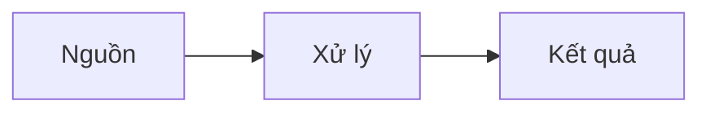

# Tên bài học

## Mục tiêu

- 

## Bức tranh lớn

Viết 3-5 dòng trả lời: chủ đề này giải quyết vấn đề gì trong DevOps?

## Sơ đồ minh họa

Khi chủ đề có flow, kiến trúc hoặc quan hệ thành phần, thêm Mermaid/Excalidraw/ảnh tham khảo tại đây.



## Khái niệm chính

| Khái niệm | Giải thích bằng lời của mình | Ví dụ |
| --- | --- | --- |
|  |  |  |

## Lệnh hoặc ví dụ

```bash

```

## Lab nhỏ

Mục tiêu:

Các bước:

1. 
2. 
3. 

Kết quả mong đợi:

## Lỗi thường gặp

| Lỗi | Dấu hiệu | Cách xử lý |
| --- | --- | --- |
|  |  |  |

## Câu hỏi ôn tập

- 

## Liên kết nội bộ

- 
